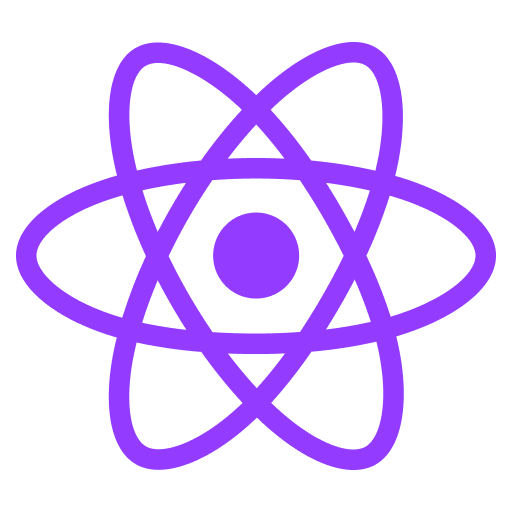

<h1 align="center">
  <br>
  <a href="https://github.com/GabrielGuedess/NextJs-Boilerplate"></a>
  <br>
 
  NextJs Boilerplate
  <br>
</h1>

<h4 align="center">A Better template with <a href="https://nextjs.org" target="_blank"><em>NextJs</em></a> with technologies to improve development.</h4>

<p align="center">
  <a href="https://codecov.io/gh/GabrielGuedess/NextJs-Boilerplate">
    
  </a>

  <a href="#">
    
  </a>

  <a href="#">
    
  </a>

  <a href="https://codeleap-network-gabrielguedess.netlify.app">
    
  </a>

  <a href="#">
    
  </a>

  <a href="https://wakatime.com/badge/github/GabrielGuedess/CodeLeap">
    
  </a>
</p>

  <p align="center">
    <a href="https://nextjs-boilerplate-gabrielguedess.vercel.app">View Demo</a>
    ·
    <a href="https://github.com/GabrielGuedess/NextJs-Boilerplate/issues">Report Bug</a>
    ·
    <a href="https://github.com/GabrielGuedess/NextJs-Boilerplate/issues">Request Feature</a>
  </p>


<!-- TABLE OF CONTENTS -->

<details>
  <summary>Table of Contents</summary>
  <ol>
    <li>
      <a href="#about-the-project">About The Project</a>
      <ul>
        <li><a href="#built-with">Built With</a></li>
        <li><a href="#storybook">Storybook</a></li>
        <li><a href="#lighthouse">Lighthouse</a></li>
        <li><a href="#codecov">Codecov</a></li>
      </ul>
    </li>
    <li>
      <a href="#getting-started">Getting Started</a>
      <ul>
        <li><a href="#prerequisites">Prerequisites</a></li>
        <li><a href="#installation">Installation</a></li>
      </ul>
    </li>
    <li><a href="#configuration">Configuration</a></li>
    <li><a href="#contributing">Contributing</a></li>
    <li><a href="#license">License</a></li>
    <li><a href="#deploying">Deploying</a></li>
    <li><a href="#contact">Contact</a></li>
  </ol>
</details>

## About The Project

### 🛠 Built With

The following tools were used in building the project:

- 
- 
- 
- 
- 
- 
- 
- 
- 
- 
- 
- 
- 
- 
- 

<p align="right">(<a href="#readme-top">back to top</a>)</p>

<!-- Storybook -->

### 🌈 Storybook

Storybook is a frontend workshop for building UI components and pages in isolation. Thousands of teams use it for UI development, testing, and documentation.

<br />

⬇️ Start Storybook

```sh
# With npm
npm run storybook

# With yarn
yarn storybook
```

⬇️ Build Storybook

```sh
# With npm
npm run build-storybook

# With yarn
yarn build-storybook
```

<br />

<div align="center">
  <a href="https://nextjs-boilerplate-storybook.netlify.app">
    Storybook Deploy ▶️
  </a>
</div>

<br />

<p align="right">(<a href="#readme-top">back to top</a>)</p>

<!-- Lighthouse -->

### 🏅 Lighthouse

<br />

<div align="center">
  <a href="">
    
  </a>
</div>

<br />

<div align="center">
<a href="https://htmlpreview.github.io/?https://github.com/GabrielGuedess/CodeLeap/blob/main/.github/assets/lighthouse/desktop/code_leap_gabrielguedess_vercel_app.html">Lighthouse Details ▶️</a>
</div>

<br />

<p align="right">(<a href="#readme-top">back to top</a>)</p>

<!-- Codecov -->

### 🔍 Codecov

Codecov provides metrics and insights into the results of tests through code coverage reports. Coverage reports are used to determine which lines of code were tested and which lines were not tested, which may contain bugs and syntax errors.

<br />

<div align="center">
  <a href="https://codecov.io/gh/GabrielGuedess/NextJs-Boilerplate">
    
  </a>
</div>

<p align="right">(<a href="#readme-top">back to top</a>)</p>

<!-- GETTING STARTED -->

## 🚀 Getting Started

### Prerequisites

To clone and run this application, you'll need _Git_ and _NodeJs_ (which comes with npm) installed on your computer.

### Installation

1. Clone the repository.

```sh
git clone https://github.com/GabrielGuedess/CodeLeap
```

2. Go into the repository

```sh
cd NextJs-Boilerplate
```

3. Install dependencies.

```sh
# With npm
npm i

# With yarn
yarn
```

4. Start project.

```sh
# With npm
npm run dev

# With yarn
yarn dev
```

> **Note**
> If you're using Linux Bash for Windows, [see this guide](https://www.howtogeek.com/261575/how-to-run-graphical-linux-desktop-applications-from-windows-10s-bash-shell/) or use `node` from the command prompt.

<p align="right">(<a href="#readme-top">back to top</a>)</p>

<!-- ROADMAP -->

## 🚨 Configuration

- [ ] Cypress
  - [ ] Add `CYPRESS_PROJECT_ID` to Github.
  - [ ] Add `CYPRESS_RECORD_KEY` to Github.
- [ ] Chromatic
  - [ ] Add `CHROMATIC_PROJECT_TOKEN` to Github.
- [ ] Lighthouse
  - [ ] Add `LIGHTHOUSE_BADGER_TOKEN` to Github.

See the [open issues](https://github.com/othneildrew/Best-README-Template/issues) for a full list of proposed features (and known issues).

<p align="right">(<a href="#readme-top">back to top</a>)</p>

<!-- CONTRIBUTING -->

## 👏 Contributing

Contributions are what make the open source community such an amazing place to learn, inspire, and create. Any contributions you make are **greatly appreciated**.

If you have a suggestion that would make this better, please fork the repo and create a pull request. You can also simply open an issue with the tag "enhancement".

1. Fork the Project
2. Create your Feature Branch (`git checkout -b feature/NewFeature`)
3. Commit your Changes (`git commit -m 'Add some NewFeature'`)
4. Push to the Branch (`git push origin feature/NewFeature`)
5. Open a Pull Request

<p align="right">(<a href="#readme-top">back to top</a>)</p>

<!-- LICENSE -->

## 📄 License

Distributed under the MIT License. See [MIT license](LICENSE) for more information.

<p align="right">(<a href="#readme-top">back to top</a>)</p>

<!-- Deploying -->

## 🌐 Deploying

<br />

[](https://nextjs-boilerplate-gabrielguedess.vercel.app)

<p align="right">(<a href="#readme-top">back to top</a>)</p>

<!-- CONTACT -->

## ⭐ Contact

Gabriel Guedes - [@GabrielRGuedess](https://twitter.com/GabrielRGuedess) - gabrielrguedess@gmail.com

Project Link: [https://nextjs-boilerplate-gabrielguedess.vercel.app](https://nextjs-boilerplate-gabrielguedess.vercel.app)

---

<p align="center">
Made with ♥ by 👨‍🚀 Gabriel Guedes 👋 <a href="https://www.linkedin.com/in/gabriel-guedess/">Get in touch!</a>
</p>

<p align="right">(<a href="#readme-top">back to top</a>)</p>
